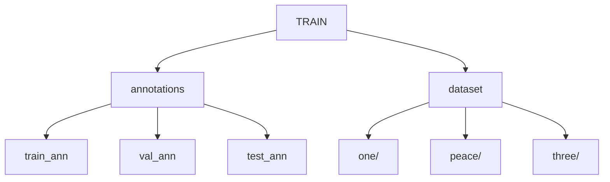
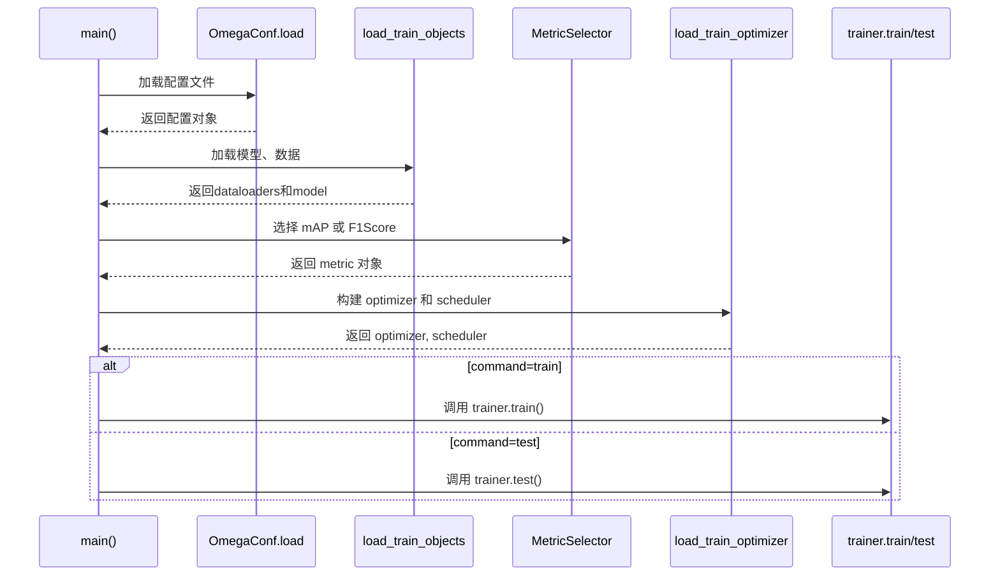

```mermaid
graph TD
    TRAIN --> annotations
    TRAIN --> dataset

    annotations --> train_ann
    annotations --> val_ann
    annotations --> test_ann


    dataset --> one_dir["one/"]
    dataset --> peace_dir["peace/"]
    dataset --> three_dir["three/"]

```

```mermaid
sequenceDiagram
    participant 主程序 as main()
    participant OmegaConf.load
    participant 数据加载 as load_train_objects
    participant 指标选择 as MetricSelector
    participant 优化器加载 as load_train_optimizer
    participant 训练/测试 as trainer.train/test

    主程序->>OmegaConf.load: 加载配置文件
    OmegaConf.load-->>主程序: 返回配置对象

    主程序->>数据加载: 加载模型、数据
    数据加载-->>主程序: 返回dataloaders和model

    主程序->>指标选择: 选择 mAP 或 F1Score
    指标选择-->>主程序: 返回 metric 对象

    主程序->>优化器加载: 构建 optimizer 和 scheduler
    优化器加载-->>主程序: 返回 optimizer, scheduler

    alt command=train
        主程序->>训练/测试: 调用 trainer.train()
    else command=test
        主程序->>训练/测试: 调用 trainer.test()
    end

```

